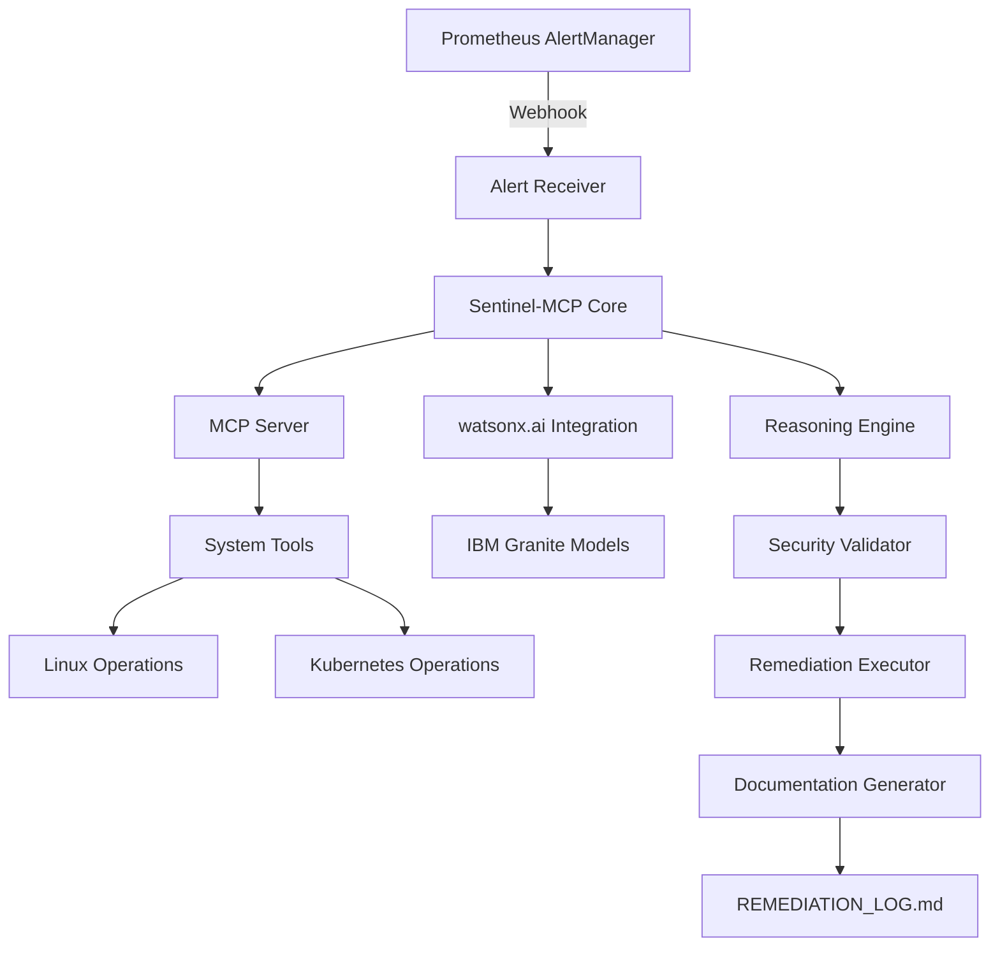

# Sentinel-MCP Architecture Plan

## Executive Summary

Sentinel-MCP is an autonomous infrastructure repair agent that bridges monitoring alerts with intelligent remediation using IBM Bob and watsonx.ai. The system uses the Model Context Protocol (MCP) to enable Bob to interact with live infrastructure environments.

## System Architecture



## Core Components

### 1. MCP Server (Rust)
**Purpose**: Expose system operations as MCP tools that Bob can invoke

**Key Tools**:
- `read_system_logs`: Read system logs (syslog, journalctl, application logs)
- `execute_remediation_script`: Execute approved remediation commands
- `check_kubernetes_status`: Query Kubernetes cluster state
- `get_disk_usage`: Check filesystem usage
- `list_systemd_services`: List and check service status
- `get_process_info`: Retrieve process information

**Security Features**:
- Command whitelist/blacklist
- Dry-run mode for all operations
- Audit logging for all tool invocations
- User approval workflow for destructive operations

### 2. Alert Receiver
**Purpose**: Accept and parse Prometheus AlertManager webhooks

**Functionality**:
- HTTP endpoint for AlertManager webhooks
- Alert normalization and enrichment
- Priority classification
- Alert deduplication

### 3. watsonx.ai Integration Module
**Purpose**: Leverage IBM Granite models for intelligent log analysis

**Capabilities**:
- Log summarization and pattern recognition
- Root cause analysis
- Remediation suggestion generation
- Historical incident correlation

### 4. Reasoning Engine
**Purpose**: Orchestrate the analysis and remediation workflow

**Workflow**:
1. Receive alert from Alert Receiver
2. Gather context via MCP tools (logs, system state)
3. Send context to watsonx.ai for analysis
4. Parse AI response and extract remediation steps
5. Validate remediation against security constraints
6. Request user approval (if required)
7. Execute remediation
8. Verify success and document outcome

### 5. Security Validator
**Purpose**: Ensure all remediation actions are safe and authorized

**Validation Rules**:
- No destructive commands without approval
- No privilege escalation without review
- All database operations require explicit approval
- Kubernetes operations limited to specific namespaces

### 6. Remediation Executor
**Purpose**: Execute approved remediation actions safely

**Execution Modes**:
- **Dry-run**: Simulate execution and report expected changes
- **Interactive**: Execute with step-by-step confirmation
- **Autonomous**: Execute automatically for approved actions

### 7. Documentation Generator
**Purpose**: Auto-generate comprehensive remediation reports

## Technology Stack

### Core Technologies
- **Language**: Rust (for MCP server and core logic)
- **MCP SDK**: Rust MCP implementation
- **HTTP Server**: Axum (async Rust web framework)
- **Kubernetes Client**: kube-rs
- **System Operations**: tokio-process, sysinfo

### AI/ML Integration
- **IBM watsonx.ai**: IBM Granite models
- **HTTP Client**: reqwest (for API calls)

### Infrastructure
- **Container Runtime**: Docker
- **Orchestration**: Kubernetes (for deployment)
- **Monitoring**: Prometheus + AlertManager

## Repository Structure

```
sentinel-mcp/
├── src/
│   ├── main.rs                 # Entry point
│   ├── mcp/
│   │   ├── mod.rs              # MCP server implementation
│   │   ├── tools.rs            # MCP tool definitions
│   │   └── security.rs         # Security validator
│   ├── alert/
│   │   ├── mod.rs              # Alert receiver
│   │   └── parser.rs           # Alert parsing logic
│   ├── watsonx/
│   │   ├── mod.rs              # watsonx.ai client
│   │   └── prompts.rs          # Prompt templates
│   ├── reasoning/
│   │   ├── mod.rs              # Reasoning engine
│   │   └── workflow.rs         # State machine
│   └── executor/
│       ├── mod.rs              # Remediation executor
│       └── rollback.rs         # Rollback support
├── tests/
│   ├── integration/            # Integration tests
│   └── scenarios/              # Failure scenarios
├── prompts/
│   ├── 01-scaffold.md          # Bob prompt for scaffolding
│   ├── 02-mcp-tools.md         # Bob prompt for MCP tools
│   ├── 03-watsonx.md           # Bob prompt for watsonx integration
│   └── 04-testing.md           # Bob prompt for testing
├── docs/
│   ├── ARCHITECTURE.md         # This file
│   ├── API.md                  # API documentation
│   ├── SECURITY.md             # Security guidelines
│   └── bob-export.md           # IBM Bob exported report
├── k8s/
│   ├── deployment.yaml         # Kubernetes deployment
│   ├── service.yaml            # Kubernetes service
│   ├── rbac.yaml               # RBAC configuration
│   └── configmap.yaml          # Configuration
├── examples/
│   ├── alerts/                 # Example alert payloads
│   ├── logs/                   # Example log files
│   └── remediations/           # Example remediation logs
├── scripts/
│   ├── setup.sh                # Setup script
│   ├── demo.sh                 # Demo script
│   └── test-failure.sh         # Failure injection script
├── Cargo.toml                  # Rust dependencies
├── Dockerfile                  # Container image
├── README.md                   # Project documentation
└── LICENSE                     # License file
```

## Implementation Timeline

### Phase 1: Foundation
- Project scaffolding
- MCP server basic implementation
- Alert receiver setup

### Phase 2: Core Logic
- watsonx.ai integration
- Reasoning engine
- Security validator

### Phase 3: Execution
- Remediation executor
- Documentation generator
- Rollback support

### Phase 4: Testing & Demo
- Test suite development
- Demo scenario preparation
- Documentation finalization