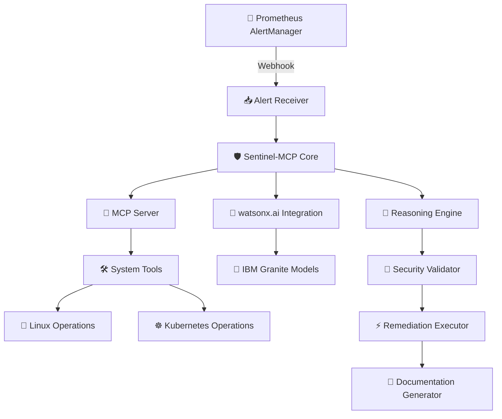

<div align="center">


# Sentinel-MCP
### The Autonomous Infrastructure Repair Agent

[](https://opensource.org/licenses/MIT)
[](https://www.rust-lang.org/)
[](https://www.ibm.com/watsonx)
[](https://modelcontextprotocol.io)
[](https://github.com/paulmmoore3416/Sentinel-MCP)
[](CONTRIBUTING.md)
[](https://www.ibm.com/watsonx)

**Bridging the gap between monitoring alerts and autonomous infrastructure remediation**

[Features](#-key-features) • [Quick Start](#-quick-start) • [Demo](#-testing--demo) • [Documentation](#-documentation) • [Contributing](#-contributing)

</div>

---

## 🎯 Problem Statement

Infrastructure teams are overwhelmed by **alert fatigue**. When a server or application fails, DevOps engineers must manually:
- 📊 Correlate logs from multiple sources
- 🔍 Identify the root cause
- 🔧 Apply a fix
- 📝 Document the remediation

This manual intervention leads to:
- ⏱️ Higher Mean Time to Recovery (MTTR)
- 😓 Operational burnout
- ⚠️ Inconsistent remediation practices
- 📉 Poor documentation

## 💡 Solution

**Sentinel-MCP** is an autonomous remediation agent that uses the Model Context Protocol (MCP) to bridge IBM Bob with live system environments (Kubernetes, Linux, Cloud APIs).

### ✨ Key Features

<table>
<tr>
<td width="50%">

#### 🤖 Autonomous Reasoning
Uses IBM Bob's agentic capabilities to analyze and fix infrastructure issues

#### 🧠 AI-Powered Analysis
Leverages IBM Granite models via watsonx.ai for intelligent log analysis

#### 🔒 Security-First
Built-in security constraints and approval workflows with circuit breakers

#### 📝 Auto-Documentation
Generates comprehensive remediation reports automatically

</td>
<td width="50%">

#### 🔄 Rollback Support
Safe execution with automatic rollback capabilities

#### 🎯 Multi-Environment
Supports both Kubernetes and Linux bare-metal systems

#### 🔌 Plugin System
Extensible architecture for custom remediation strategies

#### 📊 Real-time Monitoring
WebSocket notifications, Prometheus metrics, and health checks

</td>
</tr>
</table>

### 🆕 Production-Ready Features

- **🔁 Retry Logic**: Exponential backoff with jitter for resilient operations
- **⚡ Circuit Breakers**: Prevent cascading failures with automatic recovery
- **🔧 CLI Tool**: Comprehensive command-line interface for management
- **📈 Metrics**: Prometheus-compatible metrics with Grafana dashboards
- **🔔 WebSocket**: Real-time notifications for alert processing and remediation
- **⚙️ Hot-Reload**: Configuration changes without service restart
- **🔐 RBAC**: Role-based access control for Kubernetes operations
- **📦 Containerized**: Docker and Kubernetes deployment ready

## 🏗️ Architecture



## 🚀 Quick Start

### Prerequisites

```bash
✅ Rust 1.75+ and Cargo
✅ Docker and Docker Compose
✅ Kubernetes cluster (for K8s features)
✅ IBM Cloud account with watsonx.ai access
✅ Prometheus and AlertManager (optional, for full demo)
```

### Installation

#### 1️⃣ Clone the repository
```bash
git clone https://github.com/paulmmoore3416/Sentinel-MCP.git
cd Sentinel-MCP
```

#### 2️⃣ Set up environment variables
```bash
cp .env.example .env
# Edit .env with your credentials
```

Required environment variables:
```bash
# IBM watsonx.ai Configuration
WATSONX_API_KEY=your_api_key_here
WATSONX_PROJECT_ID=your_project_id_here
WATSONX_URL=https://us-south.ml.cloud.ibm.com

# MCP Server Configuration
MCP_SERVER_PORT=3000
MCP_AUTH_TOKEN=your_secure_token_here

# Security Settings
APPROVAL_REQUIRED=true
DRY_RUN_MODE=false
```

#### 3️⃣ Build the project
```bash
cargo build --release
```

#### 4️⃣ Run the server
```bash
# Using cargo
cargo run --release

# Or using the CLI
./target/release/sentinel-mcp start --port 3000

# With custom config
./target/release/sentinel-mcp start --config config.yaml

# In interactive mode (requires approval for all actions)
./target/release/sentinel-mcp start --interactive

# In dry-run mode (simulates without executing)
./target/release/sentinel-mcp start --dry-run
```

## 🎮 CLI Usage

Sentinel-MCP includes a comprehensive CLI for easy management:

```bash
# Start the server
sentinel-mcp start --port 3000

# Check server status
sentinel-mcp status

# Test with an alert file
sentinel-mcp test --alert examples/alerts/disk-space-low.json

# Simulate failure scenarios
sentinel-mcp simulate disk-full
sentinel-mcp simulate service-crash nginx
sentinel-mcp simulate pod-crashloop

# Plugin management
sentinel-mcp plugin list
sentinel-mcp plugin info disk-cleanup
sentinel-mcp plugin test disk-cleanup --alert test-alert.json

# Configuration management
sentinel-mcp config validate
sentinel-mcp config show
sentinel-mcp config example --output my-config.yaml

# View logs
sentinel-mcp logs --lines 100 --follow
sentinel-mcp logs --level error

# Generate reports
sentinel-mcp report summary --range 24h
sentinel-mcp report detailed --output report.md

# Health check
sentinel-mcp health
sentinel-mcp health --component watsonx_connection
```

## 📖 Usage Guide

### Basic Usage

#### 🎬 Starting Sentinel-MCP

```bash
# Start in interactive mode (requires approval for all actions)
./target/release/sentinel-mcp --mode interactive

# Start in autonomous mode (auto-approves low-risk actions)
./target/release/sentinel-mcp --mode autonomous

# Start in dry-run mode (simulates all actions)
./target/release/sentinel-mcp --mode dry-run
```

#### 🚨 Triggering an Alert

**Manual trigger via CLI:**
```bash
# Simulate a disk space alert
curl -X POST http://localhost:3000/api/v1/alerts \
  -H "Content-Type: application/json" \
  -H "Authorization: Bearer ${MCP_AUTH_TOKEN}" \
  -d @examples/alerts/disk-space-low.json
```

**Example alert payload** (`examples/alerts/disk-space-low.json`):
```json
{
  "alerts": [{
    "status": "firing",
    "labels": {
      "alertname": "DiskSpaceLow",
      "severity": "warning",
      "instance": "server-01",
      "filesystem": "/var"
    },
    "annotations": {
      "summary": "Disk space is critically low",
      "description": "Filesystem /var is at 92% capacity on server-01"
    },
    "startsAt": "2026-05-02T18:00:00Z"
  }]
}
```

#### 📊 Monitoring the Remediation Process

The system will:
1. ✅ Receive and parse the alert
2. 🔍 Gather system context (logs, disk usage, processes)
3. 🧠 Analyze with watsonx.ai
4. 💡 Propose remediation steps
5. ⏸️ Request approval (if in interactive mode)
6. ⚡ Execute remediation
7. ✔️ Verify success
8. 📝 Generate documentation

**Watch the logs:**
```bash
tail -f logs/sentinel-mcp.log
```

**View the remediation report:**
```bash
cat logs/remediations/REMEDIATION_LOG_$(date +%Y%m%d).md
```

### Advanced Usage

#### 🔔 Using with Prometheus AlertManager

**1. Configure AlertManager webhook** (`alertmanager.yml`):
```yaml
route:
  receiver: 'sentinel-mcp'
  group_by: ['alertname', 'instance']
  group_wait: 10s
  group_interval: 10s
  repeat_interval: 1h

receivers:
  - name: 'sentinel-mcp'
    webhook_configs:
      - url: 'http://sentinel-mcp:3000/api/v1/alerts'
        send_resolved: true
        http_config:
          bearer_token: 'your_mcp_auth_token'
```

**2. Restart AlertManager:**
```bash
kubectl rollout restart deployment/alertmanager -n monitoring
```

#### ☸️ Kubernetes Deployment

**1. Create namespace:**
```bash
kubectl create namespace sentinel-system
```

**2. Create secrets:**
```bash
kubectl create secret generic watsonx-credentials \
  --from-literal=api-key=${WATSONX_API_KEY} \
  --from-literal=project-id=${WATSONX_PROJECT_ID} \
  -n sentinel-system
```

**3. Deploy Sentinel-MCP:**
```bash
kubectl apply -f k8s/
```

**4. Verify deployment:**
```bash
kubectl get pods -n sentinel-system
kubectl logs -f deployment/sentinel-mcp -n sentinel-system
```

## 🧪 Testing & Demo

### Running the Test Suite

```bash
# Run all tests
cargo test

# Run integration tests only
cargo test --test integration

# Run with verbose output
cargo test -- --nocapture
```

### 🎭 Demo Scenarios

We've included several pre-built failure scenarios for demonstration:

#### 💾 Scenario 1: Disk Space Cleanup

```bash
# Inject failure
./scripts/test-failure.sh disk-full

# Watch Sentinel-MCP detect and fix
tail -f logs/sentinel-mcp.log

# Verify remediation
df -h /var
cat logs/remediations/REMEDIATION_LOG_*.md
```

**Expected outcome:**
- ✅ Sentinel detects disk at 95% capacity
- 🔍 Analyzes logs to find old/rotatable files
- 💡 Proposes cleanup of `/var/log/old-logs`
- ⚡ Executes cleanup after approval
- ✔️ Verifies disk usage reduced to ~45%
- 📝 Documents the entire process

#### 🔧 Scenario 2: Service Crash Recovery

```bash
# Inject failure
./scripts/test-failure.sh service-crash nginx

# Watch auto-recovery
journalctl -u nginx -f
```

**Expected outcome:**
- ✅ Sentinel detects nginx service stopped
- 🔍 Analyzes crash logs
- 💡 Identifies configuration error or resource issue
- ⚡ Restarts service with corrected configuration
- ✔️ Verifies service is running and healthy

#### ☸️ Scenario 3: Kubernetes Pod CrashLoop

```bash
# Inject failure
kubectl apply -f examples/scenarios/crashloop-pod.yaml

# Watch Sentinel-MCP diagnose and fix
kubectl logs -f deployment/sentinel-mcp -n sentinel-system
```

**Expected outcome:**
- ✅ Sentinel detects pod in CrashLoopBackOff
- 🔍 Analyzes pod logs and events
- 💡 Identifies missing ConfigMap or resource limits
- ⚡ Proposes fix (create ConfigMap or adjust limits)
- ✔️ Applies fix after approval
- ✅ Verifies pod is running

### 🎨 Creating Custom Scenarios

Create a new scenario file in `examples/scenarios/`:

```yaml
# examples/scenarios/custom-failure.yaml
apiVersion: v1
kind: ConfigMap
metadata:
  name: failure-scenario
  namespace: default
data:
  type: "memory-leak"
  severity: "critical"
  description: "Simulate memory leak in application"
  trigger_command: "stress --vm 1 --vm-bytes 2G --timeout 300s"
  expected_remediation: "Restart pod with memory limits"
```

## ⚙️ Configuration

### 🔐 Security Configuration

Edit `config/security-rules.yaml`:

```yaml
security_rules:
  # Commands that require approval
  high_risk_commands:
    - "rm -rf"
    - "DROP DATABASE"
    - "kubectl delete namespace"
  
  # Commands that can auto-execute
  low_risk_commands:
    - "systemctl restart"
    - "kubectl rollout restart"
    - "docker restart"
  
  # Kubernetes namespaces allowed for operations
  allowed_namespaces:
    - "default"
    - "production"
    - "staging"
  
  # Maximum disk space to clean (in GB)
  max_disk_cleanup: 50
```

### 🤖 watsonx.ai Configuration

Edit `config/watsonx.yaml`:

```yaml
watsonx:
  model: "ibm/granite-13b-instruct-v2"
  parameters:
    max_new_tokens: 1024
    temperature: 0.7
    top_p: 0.9
  
  prompts:
    log_analysis: |
      You are an expert SRE analyzing infrastructure logs.
      Analyze the following logs and identify the root cause.
      Provide a concise analysis and suggest remediation steps.
      
      Logs:
      {log_content}
```

## 📊 Monitoring & Observability

### 📈 Metrics

Sentinel-MCP exposes Prometheus metrics at `/metrics`:

```bash
curl http://localhost:3000/metrics
```

**Key metrics:**
- `sentinel_alerts_received_total`: Total alerts received
- `sentinel_remediations_executed_total`: Total remediations executed
- `sentinel_remediations_success_rate`: Success rate of remediations
- `sentinel_mttr_seconds`: Mean time to recovery
- `sentinel_watsonx_api_calls_total`: Total watsonx.ai API calls

### 📊 Grafana Dashboard

Import the pre-built dashboard:

```bash
kubectl apply -f k8s/grafana-dashboard.yaml
```

Access Grafana and import dashboard ID: `sentinel-mcp-overview`

## 🎥 Video Demo Script

### 🎬 Setup (30 seconds)

1. Show terminal with Sentinel-MCP running
2. Show Prometheus dashboard with healthy metrics
3. Explain the scenario: "We'll simulate a disk space crisis"

### ⚡ Action (90 seconds)

**1. Inject failure:**
```bash
./scripts/test-failure.sh disk-full
```

**2. Split screen:**
- Left: Sentinel-MCP logs showing detection and analysis
- Right: System terminal showing disk usage

**3. Show AI reasoning:**
- Display watsonx.ai analysis of logs
- Show proposed remediation steps
- Highlight security validation

**4. Execute remediation:**
- Show approval prompt
- Execute cleanup
- Verify disk space recovered

### 💎 Value Proposition (60 seconds)

**1. Show auto-generated documentation:**
```bash
cat logs/remediations/REMEDIATION_LOG_20260502.md
```

**2. Highlight key benefits:**
- ⏱️ MTTR reduced from 30 minutes to 2 minutes
- 🤖 Zero manual intervention required
- 📝 Complete audit trail automatically generated
- 🧠 AI-powered root cause analysis

**3. Show IBM Bob integration:**
- Display exported Bob conversation
- Show how Bob orchestrated the solution
- Emphasize AI-native development process

## 🤖 IBM Bob Integration

### 📝 Bob Prompts Used

All prompts used with IBM Bob are documented in the `/prompts` directory:

**1. Scaffolding** (`prompts/01-scaffold.md`):
```
Bob, help me scaffold a new project for an MCP server using Rust.
This server needs to expose tools for reading system logs and
executing remediation scripts. Follow enterprise security standards.
```

**2. MCP Tools** (`prompts/02-mcp-tools.md`):
```
In Plan Mode, design the MCP tools for Sentinel-MCP:
1. read_system_logs - Read logs from various sources
2. execute_remediation_script - Execute approved commands
3. check_kubernetes_status - Query K8s cluster state
Include security validation for each tool.
```

**3. watsonx Integration** (`prompts/03-watsonx.md`):
```
Bob, implement the watsonx.ai integration module.
Use IBM Granite models for log analysis.
Include error handling and retry logic.
```

**4. Testing** (`prompts/04-testing.md`):
```
Bob, generate a comprehensive test suite with:
1. Unit tests for each component
2. Integration tests for the full workflow
3. Simulated failure scenarios
```

### 📄 Exported Bob Report

The complete IBM Bob conversation and development process is documented in:
- `docs/bob-export.md` - Full conversation history
- `docs/bob-analysis.md` - Bob's architectural decisions

## 📚 Documentation

| Document | Description |
|----------|-------------|
| 🏗️ [Architecture Overview](ARCHITECTURE.md) | System design and components |
| 🚀 [Quick Start Guide](QUICKSTART.md) | 5-minute setup guide |
| 🧪 [Testing Guide](docs/TESTING_GUIDE.md) | Comprehensive testing documentation |
| 🔧 [Implementation Guide](docs/IMPLEMENTATION_GUIDE.md) | Build instructions |
| 🎥 [Video Demo Script](docs/VIDEO_DEMO_SCRIPT.md) | Demo recording guide |
| 🤝 [Contributing Guide](CONTRIBUTING.md) | How to contribute |
| 🏆 [Hackathon Submission](docs/HACKATHON_SUBMISSION.md) | Submission checklist |

## 🏆 Hackathon Submission

This project was built for the **IBM watsonx Challenge**, demonstrating:

1. **🤖 AI-Native Development**: Entire project orchestrated using IBM Bob
2. **💎 watsonx.ai Integration**: Real-world use of IBM Granite models
3. **💼 Practical Value**: Solves real infrastructure pain points
4. **🚀 Innovation**: Novel use of MCP for infrastructure automation

### ✅ Submission Checklist

- ✅ Problem and solution statement
- ✅ IBM Bob and watsonx.ai usage documented
- ✅ Implementation plan with Bob-ready prompts
- ✅ Video demo (3 minutes)
- ✅ Code repository with clear structure
- ✅ Exported Bob report
- ✅ README with usage examples

## 🤝 Contributing

We welcome contributions! Please see [CONTRIBUTING.md](CONTRIBUTING.md) for details.

### 🌟 Contributors

Thanks to all contributors who have helped make Sentinel-MCP better!

## 📄 License

This project is licensed under the MIT License - see [LICENSE](LICENSE) file for details.

## 🙏 Acknowledgments

- 💙 IBM watsonx.ai team for the powerful Granite models
- 🤖 IBM Bob team for the amazing AI development assistant
- 🔌 The MCP community for the protocol specification
- 👥 All contributors and testers

## 📞 Contact

<div align="center">

**Author**: Paul Moore

[](https://github.com/paulmmoore3416)
[](https://github.com/paulmmoore3416/Sentinel-MCP)

</div>

---

<div align="center">

**Built with ❤️ using IBM Bob and watsonx.ai**

[](https://www.ibm.com/watsonx)
[](https://www.ibm.com/products/watsonx-code-assistant)

</div>
## 📡 Real-Time Notifications

Connect to the WebSocket endpoint for real-time updates:

```javascript
const ws = new WebSocket('ws://localhost:3000/ws');

ws.onopen = () => {
  console.log('Connected to Sentinel-MCP');
  
  // Subscribe to specific events
  ws.send(JSON.stringify({
    command: 'Subscribe',
    topics: ['alerts', 'remediations']
  }));
};

ws.onmessage = (event) => {
  const notification = JSON.parse(event.data);
  
  switch(notification.type) {
    case 'AlertReceived':
      console.log('New alert:', notification.data.alert_name);
      break;
    case 'RemediationProgress':
      console.log(`Step ${notification.data.step}/${notification.data.total_steps}`);
      break;
    case 'RemediationCompleted':
      console.log('Remediation completed:', notification.data.success);
      break;
  }
};
```

## 📊 Metrics & Monitoring

### Prometheus Metrics

Sentinel-MCP exposes Prometheus-compatible metrics:

```bash
curl http://localhost:9090/metrics
```

**Key Metrics:**
- `sentinel_alerts_received_total` - Total alerts received
- `sentinel_remediations_executed_total` - Total remediations executed
- `sentinel_remediations_successful_total` - Successful remediations
- `sentinel_mttr_seconds` - Mean Time to Recovery histogram
- `sentinel_active_remediations` - Currently active remediations
- `sentinel_queue_length` - Alert queue length

### Grafana Dashboard

Import the pre-built dashboard for visualization:

```bash
# Dashboard available at grafana/sentinel-dashboard.json
```

### Health Checks

```bash
# Overall health
curl http://localhost:3000/api/v1/health

# Liveness probe (Kubernetes)
curl http://localhost:3000/api/v1/health/live

# Readiness probe (Kubernetes)
curl http://localhost:3000/api/v1/health/ready

# Metrics summary
curl http://localhost:3000/metrics/summary
```

## 🔌 Plugin Development

Create custom remediation plugins:

```rust
use sentinel_mcp::plugins::{RemediationPlugin, PluginMetadata, PluginContext};
use async_trait::async_trait;

pub struct CustomPlugin;

#[async_trait]
impl RemediationPlugin for CustomPlugin {
    fn metadata(&self) -> PluginMetadata {
        PluginMetadata {
            name: "custom-plugin".to_string(),
            version: "1.0.0".to_string(),
            author: "Your Name".to_string(),
            description: "Custom remediation logic".to_string(),
            supported_alert_types: vec!["CustomAlert".to_string()],
        }
    }
    
    fn can_handle(&self, alert: &Alert) -> bool {
        alert.labels.get("alertname")
            .map(|name| name == "CustomAlert")
            .unwrap_or(false)
    }
    
    async fn analyze(&self, context: &PluginContext) -> Result<RemediationPlan> {
        // Your analysis logic
        todo!()
    }
    
    async fn execute_step(&self, context: &PluginContext, step: &RemediationStep) 
        -> Result<ExecutionResult> {
        // Your execution logic
        todo!()
    }
    
    async fn verify(&self, context: &PluginContext) -> Result<VerificationResult> {
        // Your verification logic
        todo!()
    }
}
```

Register your plugin:

```rust
let registry = PluginRegistry::new();
registry.register(Arc::new(CustomPlugin)).await?;
```
